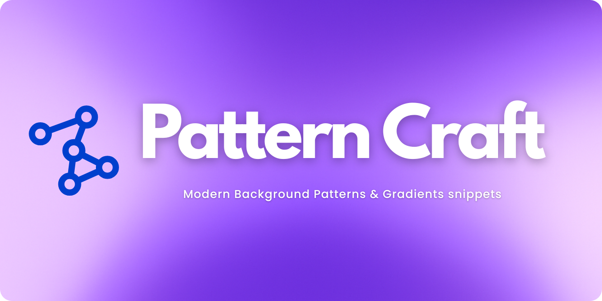
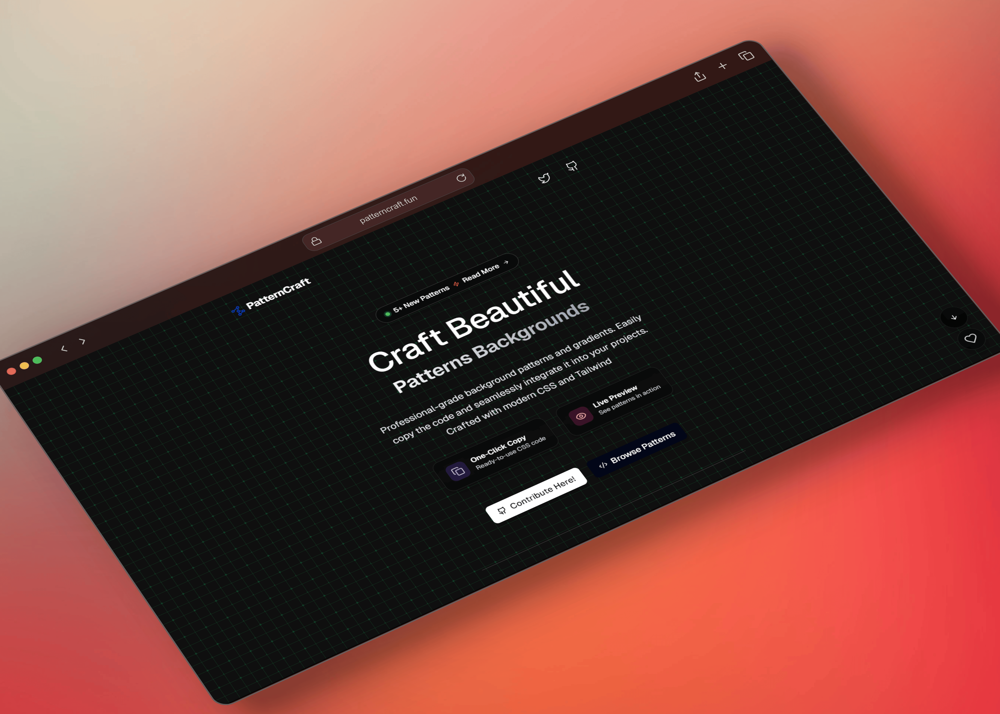
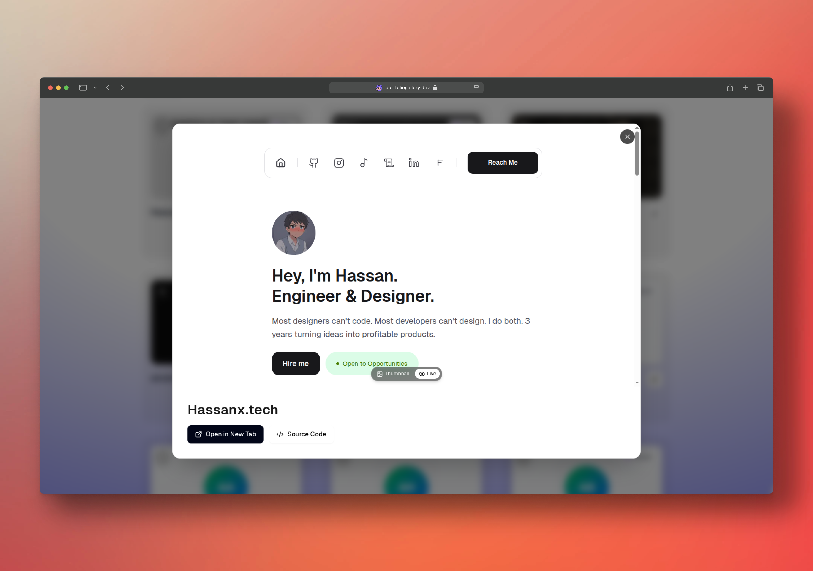
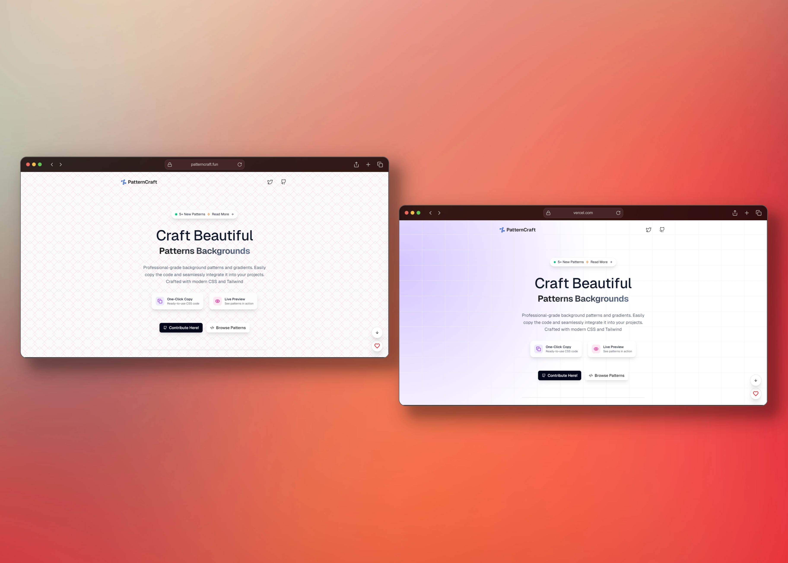

# Portfolio Gallery

> _**For developers, by developers. Showcase your work with style⚡**_

<div align="center">
  
  <br><br>
  <p align="left">
    <strong>Discover and showcase 100+ stunning developer portfolios with live previews and source code access.</strong>
    Browse curated portfolios by category, search for inspiration, and save your favorites. Built with modern Next.js and Tailwind CSS for seamless performance and beautiful design.<br>
    </br>
    <em>Perfect for developers seeking inspiration, hiring managers evaluating talent, and teams building portfolio collections. Made for devs who appreciate great design and want to showcase their work.</em>
    </br>
  </p>
  <br>
  <p align="center">
    


<a href="https://vercel.com/oss">
    
</a>
    
  </p>
</div>

---

> **This project is proudly sponsored by [Vercel](https://vercel.com/oss). Thank you for supporting open source!**

  <p align="center">
<a href="https://vercel.com/oss">

</a>
</p>

## Visit: **[Portfolio Gallery](https://portfoliogallery.dev)**






> _**Note: This project showcases real developer portfolios with live previews, source code links, and inspiration for developers and designers.**_  
> [Learn more about contributing portfolios.](https://github.com/HassanXTech/portfolio-gallery/discussions)

## Portfolio Gallery in the Wild!!!

<p align="left"> 
Curious where Portfolio Gallery is getting featured, shared, talked about or appreciated? 
</br>
Check out this growing list of shoutouts, showcases, and love from the community:  
</br>

⚡[**Where Portfolio Gallery is Making Noise??**](https://github.com/HassanXTech/portfolio-gallery/discussions)
</p>


## Features

- **Live Portfolio Previews** - See portfolios in action with iframe embeds
- **Source Code Access** - Direct links to GitHub repositories and source code
- **Category Organization** - Browse by Web Development, Mobile Apps, UI/UX Design, and more
- **Search & Filter** - Find portfolios by name, category, or tags
- **Favorites System** - Save and organize your preferred portfolios
- **Responsive Design** - Optimized for all screen sizes and devices
- **Modern UI/UX** - Beautiful, intuitive interface built with Tailwind CSS
- **Portfolio Thumbnails** - Visual previews with auto-background fill
- **Smooth Navigation** - Category carousel with pinned tabs and smooth scrolling
- **Dark/Light Theme** - Automatic theme switching with system preference support

## Tech Stack

- **Next.js 15** - React framework with App Router
- **TypeScript** - Type-safe development
- **Tailwind CSS** - Utility-first CSS framework
- **Vercel** - Deployment and hosting
- **React Context** - State management for favorites
- **Next.js Image** - Optimized image handling

## Sponsored by <a href="https://vercel.com/oss">Vercel⚡</a>

**This project is proudly powered by <b>Vercel</b>. The platform behind Portfolio Gallery's blazing-fast deployment and seamless scalability.**<br>

<i>Big thanks to Vercel for supporting open source and keeping this project running smoothly!</i>
<br><br>
<a href="https://vercel.com/oss">

</a>

</p>

## Getting Started

### Prerequisites

- Node.js 18+
- npm, yarn, pnpm, or bun

### Installation

1. Clone the repository:

```bash
git clone https://github.com/HassanXTech/portfolio-gallery.git
cd portfolio-gallery
```

2. Install dependencies:

```bash
npm install
# or
yarn install
# or
pnpm install
```

3. Run the development server:

```bash
npm run dev
# or
yarn dev
# or
pnpm dev
```

4. Open [http://localhost:3000](http://localhost:3000) in your browser

### Build for Production

```bash
npm run build
npm start
```

## How to Use This

1. Visit the live site: **[https://portfoliogallery.dev](https://portfoliogallery.dev)**
2. Browse through the collection of developer portfolios by category.
3. Click on any portfolio to open its preview modal with live website preview.
4. Use the toggle to switch between thumbnail and live preview.
5. Access source code and visit the live website directly from the modal.
6. Add portfolios to your favorites for easy access later.

These portfolios are great for:

- Finding design inspiration
- Evaluating developer talent
- Learning new techniques
- Building your own portfolio

## Demo

[Watch the demo video](https://github.com/user-attachments/assets/c283ecbc-8732-412b-adab-5c17d1a390cc)

## Customization

### Adding New Portfolios

You can easily add new portfolios by modifying the portfolio data structure. Each portfolio follows this format:

```typescript
{
  id: "unique-portfolio-id",
  name: "Portfolio Display Name",
  category: "web-development",
  description: "A brief description of the portfolio",
  badge: "New", // Optional: "New", "Popular"
  thumbnailUrl: "https://example.com/thumbnail.png",
  liveUrl: "https://example.com",
  sourceUrl: "https://github.com/username/repo",
  tags: ["React", "Next.js", "Tailwind CSS"],
  thumbnailFit: "contain", // "contain" or "cover"
  style: {
    background: "#ffffff",
    // Optional custom background styling
  },
}
```

### Portfolio Categories

The application supports these portfolio categories:

- **Web Development** - Full-stack web applications
- **Mobile Apps** - iOS and Android applications
- **UI/UX Design** - User interface and experience design
- **Data Science & ML** - Machine learning and data projects
- **Backend & DevOps** - Server-side and infrastructure
- **Agency** - Creative agency portfolios
- **Design Engineering** - Design systems and engineering
- **Indie Makers** - Independent developer projects
- **Game Dev** - Game development portfolios
- **Student/Junior** - Early career developers
- **Content & Writing** - Technical writing and content

### Customization Tips

**Thumbnails**: Use high-quality images with 16:9 aspect ratio
**Live URLs**: Ensure websites are accessible and mobile-friendly
**Source Code**: Link to public repositories with clear documentation
**Tags**: Use relevant, searchable technology tags
**Descriptions**: Write clear, concise descriptions of the work

## Usage

1. Browse the portfolio collection on the website
2. Use category tabs to filter by portfolio type
3. Search for specific portfolios or technologies
4. Click on portfolios to see live previews
5. Add interesting portfolios to your favorites
6. Access source code and live websites directly

Each portfolio includes:

- High-quality thumbnail preview
- Live website preview (when available)
- Source code repository link
- Technology tags and descriptions
- Responsive design showcase

## Contributing

> **This project is sponsored by Vercel, which helps us maintain a stable development environment.**

We welcome contributions to expand the portfolio collection. To add new portfolios:

### Adding New Portfolios

1. Fork the repository
2. Create a feature branch:

```bash
git checkout -b feature/new-portfolio-name
```

3. Navigate to `src/data/portfolios.ts`
4. Add your portfolio following the established format:

```typescript
{
  id: "unique-portfolio-id",
  name: "Portfolio Display Name",
  category: "web-development",
  description: "A brief description of the portfolio",
  badge: "New", // Optional: "New", "Popular"
  thumbnailUrl: "https://example.com/thumbnail.png",
  liveUrl: "https://example.com",
  sourceUrl: "https://github.com/username/repo",
  tags: ["React", "Next.js", "Tailwind CSS"],
  thumbnailFit: "contain", // "contain" or "cover"
  style: {
    background: "#ffffff",
    // Optional custom background styling
  },
}
```

### Contribution Guidelines

- **Quality**: Ensure portfolios are professional and well-designed
- **Accessibility**: Verify live URLs are accessible and mobile-friendly
- **Documentation**: Include clear descriptions and relevant tags
- **Thumbnails**: Use high-quality images that represent the work well
- **Uniqueness**: Avoid duplicating existing portfolios
- **Performance**: Ensure live websites load reasonably fast

### Portfolio Requirements

When adding portfolios, consider:

- **Visual Appeal**: Thumbnails should be attractive and representative
- **Functionality**: Live websites should work properly
- **Code Quality**: Source repositories should be well-organized
- **Documentation**: Clear README files and setup instructions
- **Responsiveness**: Works well on different screen sizes

### Testing Your Portfolios

1. Test the portfolio in the development environment
2. Verify thumbnail displays correctly
3. Check live website accessibility
4. Ensure source code links work
5. Test responsive behavior across devices

### Pull Request Process

1. Commit your changes with descriptive messages
2. Push to your feature branch
3. Create a pull request with:
   - Clear description of the portfolio added
   - Screenshots or preview of the portfolio
   - Any special considerations or notes

```bash
git add .
git commit -m "feat: add new web development portfolio"
git push origin feature/new-portfolio-name
```

## Development

### Project Structure

```
portfolio-gallery/
src/
├── app/                   
│   ├── globals.css       
│   ├── layout.tsx        
│   ├── page.tsx           
│   └── not-found.tsx      
│
├── components/           
│   ├── ui/                # shadcn/ui components
│   │   ├── badge.tsx     
│   │   ├── button.tsx     
│   │   └── tabs.tsx       
│   ├── layout/            
│   │   ├── navbar.tsx     
│   │   └── footer.tsx     
│   ├── portfolio/         
│   │   ├── portfolio-showcase.tsx     
│   │   ├── portfolio-card.tsx        
│   │   ├── portfolio-grid.tsx         
│   │   ├── portfolio-modal.tsx
│   │   └── portfolio-empty-state.tsx 
│   ├── home/             
│   │   ├── hero.tsx               
│   │   ├── support-dropdown.tsx   
│   │   └── return-to-preview.tsx  
│   └── providers/         
│       └── theme-provider.tsx 
│
├── lib/                   
│   ├── utils.ts           
│   └── constants.ts      
│
├── hooks/                 
│   ├── useTheme.tsx       
│   └── useCopy.tsx        
│
├── types/                 
│   ├── portfolio.ts         
│   └── index.ts           
│
├── context/               
│   └── favourites-context.tsx 
│
└── data/                 
    ├── portfolios.ts      # Portfolio data (contribute here)
    └── categories.ts      
```

### Code Standards

- Use TypeScript for type safety
- Follow ESLint and Prettier configurations
- Maintain consistent code formatting
- Use semantic commit messages
- Implement proper error handling
- Follow React best practices

## License

This project is open source and available under the [MIT License](LICENSE).

## Acknowledgments

- Built with Next.js and Tailwind CSS
- Inspired by modern portfolio design patterns
- Community-driven portfolio collection
- Powered by Vercel for seamless deployment

## Support

For questions, issues, or suggestions:

- Open an issue on GitHub
- Check existing issues before creating new ones
- Provide detailed information for bug reports
- Join discussions for feature requests

## Built By

- GitHub: [@HassanXTech](https://github.com/HassanXTech)

If you like this project, consider giving it a ⭐️ on GitHub and sharing it with others!

---

> _**Happy showcasing!**_
