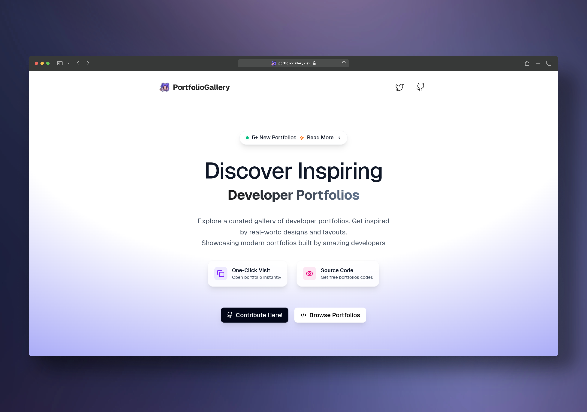

# Portfolio Gallery

> _**For developers, by developers. Portfolio that slaps⚡**_

<div align="center">
  
  <br><br>
  <p align="left">
    <strong>Discover and showcase 100+ stunning developer portfolios with live previews and source code access.</strong>
    Browse curated portfolios by category, search for inspiration, and save your favorites. Built with modern Next.js and Tailwind CSS & more tech tools for seamless performance and beautiful design.<br>
    </br>
    <em>Perfect for developers seeking inspiration, hiring managers evaluating talent, and teams building portfolio collections. Made for devs who appreciate great design and want to showcase their work.</em>
    </br>
  </p>
  <br>
  <p align="center">
    


    
  </p>
</div>

---

## Visit: **[Portfolio Gallery](https://portfoliogallery.dev)**




> _**Note: This project showcases real developer portfolios with live previews, source code links, and inspiration for developers and designers.**_  
> [Learn more about contributing portfolios.](https://github.com/HassanXTech/portfolio-gallery/discussions)

## Portfolio Gallery in the Wild!!!

<p align="left"> 
Curious where Portfolio Gallery is getting featured, shared, talked about or appreciated? 
</br>
Check out this growing list of shoutouts, showcases, and love from the community:  
</br>

⚡[**Where Portfolio Gallery is Making Noise??**](https://github.com/HassanXTech/portfolio-gallery/discussions)
</p>

## Features

- **Live Portfolio Previews** - See portfolios in action with iframe embeds
- **Source Code Access** - Direct links to GitHub repositories and source code
- **Category Organization** - Browse by Web Development, Mobile Apps, UI/UX Design, and more
- **Search & Filter** - Find portfolios by name, category, or tags
- **Favorites System** - Save and organize your preferred portfolios
- **Responsive Design** - Optimized for all screen sizes and devices
- **Modern UI/UX** - Beautiful, intuitive interface built with Tailwind CSS
- **Portfolio Thumbnails** - Visual previews with auto-background fill
- **Smooth Navigation** - Category carousel with pinned tabs and smooth scrolling
- **Dark/Light Theme** - Automatic theme switching with system preference support

## Tech Stack

- **Next.js 15** - React framework with App Router
- **TypeScript** - Type-safe development
- **Tailwind CSS** - Utility-first CSS framework
- **Vercel** - Deployment and hosting
- **React Context** - State management for favorites
- **Next.js Image** - Optimized image handling

## Getting Started

### Prerequisites

- Node.js 18+
- npm, yarn, pnpm, or bun

### Installation

1. Clone the repository:

```bash
git clone https://github.com/HassanXTech/portfolio-gallery.git
cd portfolio-gallery
```

2. Install dependencies:

```bash
npm install
# or
yarn install
# or
pnpm install
```

3. Run the development server:

```bash
npm run dev
```

4. Open [http://localhost:3000](http://localhost:3000) with your browser to see the result.

## Contributing

We welcome contributions! Here's how you can help:

### Adding New Portfolios

1. Fork the repository
2. Add your portfolio to `src/data/portfolios.ts`
3. Include a high-quality thumbnail image
4. Provide live URL and source code links
5. Submit a pull request

### Portfolio Requirements

- **High-quality thumbnail** (minimum 1200x800px)
- **Live demo URL** (working website)
- **Source code link** (GitHub repository)
- **Proper categorization** (web, mobile, uiux, etc.)
- **Responsive design** (mobile-friendly)

### Development

1. Fork the repository
2. Create a feature branch (`git checkout -b feature/amazing-feature`)
3. Commit your changes (`git commit -m 'Add amazing feature'`)
4. Push to the branch (`git push origin feature/amazing-feature`)
5. Open a Pull Request

## Portfolio Categories

- **Web Development** - Full-stack, frontend, and backend portfolios
- **Mobile Apps** - iOS, Android, and cross-platform development
- **UI/UX Design** - User interface and user experience design
- **Data Science & ML** - Data analysis, machine learning, and AI
- **Backend & DevOps** - Server-side development and infrastructure
- **Agency** - Creative agency and studio portfolios
- **Design Engineering** - Design systems and component libraries
- **Indie Makers** - Independent developers and creators
- **Game Development** - Game design and development portfolios
- **Student/Junior** - Student and junior developer portfolios
- **Content & Writing** - Technical writing and content creation

## Screenshots

<div align="center">
  
  
  
  
  
  
</div>

## Why Portfolio Gallery?

- **🎯 Curated Quality** - Hand-picked portfolios from talented developers
- **🚀 Live Previews** - See portfolios in action before visiting
- **💻 Source Code** - Access to GitHub repositories and code
- **🔍 Easy Discovery** - Search and filter by category, tags, and more
- **❤️ Favorites System** - Save and organize your favorite portfolios
- **📱 Responsive Design** - Works perfectly on all devices
- **🌙 Dark/Light Theme** - Automatic theme switching
- **⚡ Fast Performance** - Built with Next.js for optimal speed

## Community

- **Discussions** - [GitHub Discussions](https://github.com/HassanXTech/portfolio-gallery/discussions)
- **Issues** - [Report bugs or request features](https://github.com/HassanXTech/portfolio-gallery/issues)
- **Contributing** - [How to contribute](https://github.com/HassanXTech/portfolio-gallery/blob/main/CONTRIBUTING.md)

## License

This project is licensed under the MIT License - see the [LICENSE](LICENSE) file for details.

## Acknowledgments

- **Next.js Team** - For the amazing React framework
- **Tailwind CSS** - For the utility-first CSS framework
- **Vercel** - For hosting and deployment
- **All Contributors** - For making this project better

---

<div align="center">
  <p>Made with ❤️ by <a href="https://github.com/HassanXTech">HassanXTech</a></p>
  <p>If you find this project helpful, please give it a ⭐️</p>
</div>
